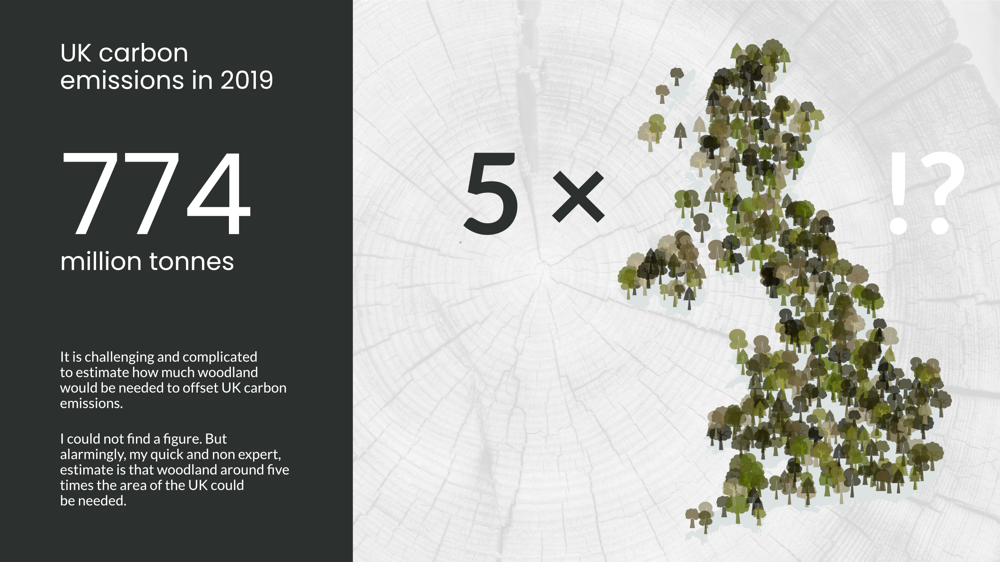

**By:** Dr. Chris Martin

**Tools used:** R, R Markdown, tidyverse packages (inc. `dplyr` and `ggplot2`), sf packages (for spatial manipulation).

**Techniques used:** creative coding.

In this notebook I use creative coding techniques to produce a woodland covered map of the UK. Later on, I edited this map to create the infographic above showing the uncertain around how much woodland would be needed to offset UK carbon emissions.

## Notebook setup

```{r setup, warning=FALSE, message=FALSE}
library(tidyverse)

library(sf)       # for mapping
library(ggsvg)    # for using svg icons in ggplot2
```

## Estimating how much woodland would offset UK carbon emissions

*\| You can skip this section if you are just interested in how place svgs icons on a map using ggplot2.*

I collected the data need to make a quick estiamte of how much woodland would offset UK carbon emissions. All data is from the UK government.

|                                                                |     |                                       |     | Source                                                                                                                                                                                 |
|----------------------------------------------------------------|-----|---------------------------------------|-----|----------------------------------------------------------------------------------------------------------------------------------------------------------------------------------------|
| **Annual carbon emissions (2019)**                             |     | 774 million tonnes CO~2~e             |     | [DEFRA, UK Government](https://www.gov.uk/government/statistics/uks-carbon-footprint/carbon-footprint-for-the-uk-and-england-to-2019)                                                  |
| **Area of the UK**                                             |     | 244511595256 m^2^ = 24451160 hectares |     | [Office for National Statistics](https://geoportal.statistics.gov.uk/datasets/ons::countries-december-2021-gb-buc/explore?location=49.003829%2C1.290710%2C5.17)                        |
| **Estimated area of UK forest (2019)**                         |     | 3.19 million hectares                 |     | [Forest Research](https://www.forestresearch.gov.uk/tools-and-resources/statistics/forestry-statistics/forestry-statistics-2019/woodland-area-and-planting-5/)                         |
| **Estimated CO~2~ sequestered per annum by UK forests (2020)** |     | 20.5 million tonnes CO~2~e pa         |     | [Forest Research](https://www.forestresearch.gov.uk/tools-and-resources/statistics/forestry-statistics/forestry-statistics-2018/uk-forests-and-climate-change-5/carbon-sequestration/) |

Based on the data in the table above, we can calculate estimated CO~2~ sequestered per annum per hectare at 6.426332 tonnes CO~2~e pa.

There is a lot of uncertainty around this. See, for example, 'On average, one hectare of native broadleaf woodland will store 300 - 350 tonnes of carbon over a 100-year period.'. This works out as 3.25 tonnes CO~2~e pa per hectare (*Source:* [The Woodland Trust](https://www.woodlandtrust.org.uk/plant-trees/woodland-carbon-farmers-and-landowners/)). I'm going to stick with estimate for now, until I can get hold of some expert input.

Based on the data at hand, I estimate that woodland around 5 times the area of the UK

```{r}
# area of woodland required to offset UK emissions (hectares)
area_to_offset <- 774 * 1e6 / 6.426332

# proportion of the UK (as woodland) required to offset UK emissions
prop_uk <- area_to_offset / (244511595256 * 0.0001)
prop_uk

```

## Producing the visualisation

### 1. Read in geospatial files

The first thing I needed was an outline of the UK (*Source:* [data.gov.uk](https://www.data.gov.uk/dataset/37edc0ad-ffff-47c9-a01c-cb8d6123ec79/nuts-level-1-january-2018-ultra-generalised-clipped-boundaries-in-the-united-kingdom)).

```{r}
# read in shapefile for the UK
uk_outline <- read_sf("../data/gd_ni/NUTS1_Jan_2018_UGCB_in_the_UK.shp") %>% 
  st_union() # I just want one polygon

# check everything looks as expected
ggplot(uk_outline) +
  geom_sf(colour=NA) +
  theme_void()

# check area of UK 
# used in the estiamte of much woodland would be needed above
st_area(uk_outline)
```

### 2. Creating a grid over the map

The next step is to divide the UK in grid cells, so I can put a specified number of trees within each cell. Later on this will allow control over how dense the woodland appears. See [sf docs](https://r-spatial.github.io/sf/reference/st_make_grid.html) for details of creating grids.

```{r, cache=TRUE}

cell_size <- 40000  # for final image
# cell_size <- 200000   # for testing (make code quicker to run)

# create a hexagonal grid
grid <- st_make_grid(uk_outline,
                     square = FALSE,
                     cellsize = cell_size) %>%
  
  # get things in the format needed later on
  as.data.frame() %>% 
  st_as_sf()

# check what the grid looks like
ggplot() +
  geom_sf(data = uk_outline, colour=NA) +
  geom_sf(data = grid, alpha = 0, colour = "grey80") +
  theme_void()

```

In the final image I only want trees in the grid cells that are over land. So, the next thing to do is drop the cells which do not cover some land.

```{r, cache=TRUE}
cell_touches_outline <- function(cell){

  cell_touches <- cell %>% 
    st_intersects(uk_outline, sparse = FALSE)

      # extract logical from matrix
  cell_touches[1,1]
}

# identify grid cells which touch the UK
grids_UK <- grid %>% 
  as.data.frame() %>% 
  mutate(cell_touches = map_lgl(geometry, ~cell_touches_outline(.x))) %>% 
  filter(cell_touches) %>% 
  st_as_sf()

# check what the grid looks like now
ggplot() +
  geom_sf(data = uk_outline, colour=NA) +
  geom_sf(data = grids_UK, alpha = 0, colour = "grey80") +
  theme_void()
```

### 3. Generating points within each grid cell

Next I generate points in random locations within each cell. This are the locations where the tree will eventually be placed.

```{r, cache=TRUE, warning=FALSE}

# I would like there to be some variation in how many trees there are in
# each cell. In this case it is going to be either 2 or 3, choosen at
# random.
num_cells <- nrow(grids_UK)
num_trees_per_cell <- sample(c(2,3), 
                             num_cells, 
                             replace = TRUE, 
                             prob = c(0.3, 0.7)
                             )

# generate specified number of points at a random location 
# within each grid cell
random_points_in_grid_cells <- st_sample(grids_UK, 
                                         size = num_trees_per_cell) %>% 
                              st_as_sf()
  
# check everything looks as expected
ggplot() +
  geom_sf(data = uk_outline, colour=NA) +
  geom_sf(data = grids_UK, alpha = 0, colour = "grey80") +
  geom_sf(data = random_points_in_grid_cells,
          alpha = 0.5) +
  theme_void()

# convert to (x,y) coordinates so can use geom_point (rather than geom_sf)
point_coord <- random_points_in_grid_cells %>% 
  
  st_filter(uk_outline[1]) %>% 
  st_coordinates() %>% 
  as_data_frame()


```

### 4. Creating a tree covered map of the UK

After all the preparatory work, we are now ready to create the tree covered map itself. This involves placing these svg icons of trees on the map, at the points generated with the grid cells.


The code below also introduces some variation in the colour and size of the trees, to help give a more organic feel to the woodland.

```{r}
# -----------------------------------------------------------------------------
# The svg tree icons as text strings
# -----------------------------------------------------------------------------

tree1_txt <- '<?xml version="1.0" encoding="UTF-8"?>
<svg width="128pt" height="128pt" version="1.1" viewBox="0 0 128 128" xmlns="http://www.w3.org/2000/svg">
 <g class="tree" id="tree1">
  <path d="m33.176 77.25c2.207 5.8359 12.145 7.6602 17.449 2.793 1.2031 9.6133 16.406 11.16 20.156 2.3633 6.293 6.1953 18.863 4.0117 23.98-4.4648 11.09 1.3281 18.73-6.3711 15.391-16.039 7.0898-6.0742 7.168-17.996-0.9375-23.188 4.3789-9.0469-4.3867-20.066-13.371-17.059-0.72266-11.395-8.3984-16.48-19.484-14.008-5-9.8281-17.031-8.8125-22.301-0.11328-11.199-3.7109-22.527 3.0312-22.438 14.266-8.9609-1.6523-15.656 8.8125-9.9336 16.246-8.582 2.4531-11.336 13.156-5.3008 19.492-8.0273 13.262 3.5977 24.848 16.789 19.711z"/>
  <path d="m60.059 38.68 6.1992 2.8281 1.5703 17.77 7.7891-6.6484-1.1719-16.301 1.0469-0.074219 2.582 14.141 9.2383-8.0078 3.5898-0.14844-1.9844 2.1367 14.703-0.9375-1.2695 1.3125-15.383 1.7227-10.25 11.039 17.551 7.0195 0.59766 2.2461-21.27-5.9023-4.9766 5.3594 6.6172 62.156h-18.324l2.2617-68.832-3.8281-5.5195-20.18-7.875-0.59766-1.8711 17.34 4.7969-11.578-16.691 2.8633-0.23438 6.9609 8.0195 0.27344-9.207 0.91016-0.16016 1.1875 12.246 6.875 8.3516z"/>
 </g>
</svg>
'

tree2_txt <- '<?xml version="1.0" encoding="UTF-8"?>
<svg width="100pt" height="100pt" version="1.1" viewBox="0 0 100 100" xmlns="http://www.w3.org/2000/svg">
 <g class="tree">
  <path d="m53.004 52.027c2.6914 2.9297 9.8594 8.7969 17.945-0.53125 0 0 14.07-6.6211 3.4141-15.508 0 0 2.8477-8.375-4.293-7.1836 0 0-0.035156-21.164-20.191-13.297 0 0-7.2656-7.5156-14.891 1.207 0 0-10.57-1.0703-11.07 10.488 0 0-4.9609 7.9492-0.20312 16 0 0-2.4453 11.035 8.3711 8.9258 0 0 4.6562 2.4648 12.867-2.3047 5.3477-3.1055 5.7539 2.3711 8.0508 2.207z"/>
  <path d="m55.082 61.758v-6.4258c-0.9375-0.66016-1.8008-1.418-2.582-2.2305-0.10547-0.015624-0.20703-0.042968-0.30859-0.070312-1.3516-0.40625-1.9766-1.7383-3.0039-2.5586-0.38281-0.30469-0.77344-0.48828-1.2656-0.5-0.8125-0.023437-1.7266 0.40625-2.4102 0.80469-1.1484 0.66797-2.375 1.2812-3.6484 1.7812v9.2031c0.17578 8.7344-2.6445 23.078-3.4531 25.742h20.133c-0.80859-2.6602-3.6289-17.004-3.4531-25.742z"/>
 </g>
</svg>'

tree3_txt <-  '<?xml version="1.0" encoding="UTF-8"?>
<svg width="100pt" height="100pt" version="1.1" viewBox="0 0 100 100" xmlns="http://www.w3.org/2000/svg">
 <g class="tree">
  <path d="m28.906 51.207-5.3945 7.7148h22.855l2.9023-30.051h1.2539l2.8984 30.051h23.066l-5.3984-7.7148h3.5625l-5.4023-7.7188h3.5625l-5.6367-8.0586h3.8008l-5.6328-8.0625h3.7969l-19.145-27.367-19.141 27.367h3.8008l-5.6367 8.0625h3.8008l-5.6367 8.0586h3.5625l-5.3984 7.7188z"/>
  <path d="m49.895 29.43-6.8086 70.57h13.621z"/>
 </g>
</svg>'

tree4_txt <-  '<?xml version="1.0" encoding="UTF-8"?>
<svg width="100pt" height="100pt" version="1.1" viewBox="0 0 100 100" xmlns="http://www.w3.org/2000/svg">
 <g class="tree">
  <path d="m50.57 22.016-6.2109 77.984h12.426z"/>
  <path d="m30.555 39.523c-5.0352 2.1406-8.4961 6.543-8.4961 11.633 0 7.1836 6.8867 13.008 15.379 13.008 3.4766 0 6.6797-0.97266 9.2539-2.6172l3.207-40.254h1.3398l3.0156 37.852c2.3438 0.99219 4.9922 1.5508 7.793 1.5508 9.6289 0 17.43-6.5977 17.43-14.738 0-5.8398-4.0156-10.887-9.8438-13.273 2.0234-3.1406 3.1797-6.7422 3.1797-10.57 0-12.215-11.703-22.113-26.148-22.113-14.441 0-26.148 9.8984-26.148 22.113 0 7.0703 3.9258 13.367 10.035 17.414z"/>
 </g>
</svg>'

# -----------------------------------------------------------------------------
# Colour palette (based on a photo of native woodland)
# -----------------------------------------------------------------------------

tree_palette <- c("#DACC9B", "#8A7441", "#5E5C17", "#49431A", "#302D09",
                  "#A9AC32", "#768A0F", "#171404")

# -----------------------------------------------------------------------------
# Create variation in the type, size and colour of the trees
# -----------------------------------------------------------------------------
plot_df <- point_coord %>% 
  mutate(
          # create variation in the type of trees
          tree_type = sample.int(4, nrow(point_coord), replace=TRUE),
          tree_svg = case_when(
             tree_type == 1 ~ tree1_txt,
             tree_type == 2 ~ tree2_txt,
             tree_type == 3 ~ tree3_txt,
             tree_type == 4 ~ tree4_txt,
             TRUE ~ tree1_txt
          ),
          
          # create variation in the size and colour of trees
          tree_size = rnorm(nrow(point_coord), 3.5, 1),
          tree_colour = sample(tree_palette, nrow(point_coord), replace=TRUE))


# -----------------------------------------------------------------------------
# Create variation woodland covered map
# -----------------------------------------------------------------------------

ggplot() +
  
  # show the outline of the UK
  geom_sf(data = uk_outline, colour=NA) +
  
  # show the trees
  geom_point_svg(data = plot_df,
             mapping = aes(X,Y, 
                           svg = I(tree_svg),
                           css(".tree", fill = tree_colour),
                           size = tree_size),
             hjust = 0.5, vjust = 0,
             css(".tree", 'fill-opacity' = 0.7),
             css(".tree", 'stroke-opacity' = 0.9)
             ) +

  # colour the trees using the specified palette
  scale_svg_fill_identity(aesthetics = css(".tree", fill = tree_colour)) +
  
  # simplify the map for editting in graphic design software
  theme_void() +
  theme(plot.background = element_rect(fill="white", colour="white"),
        legend.position = "none")

# save the map / creative coding for editing in Graphic Design software
ggsave("../image_output/debug.svg")
ggsave("../image_output/debug.jpg")
```
